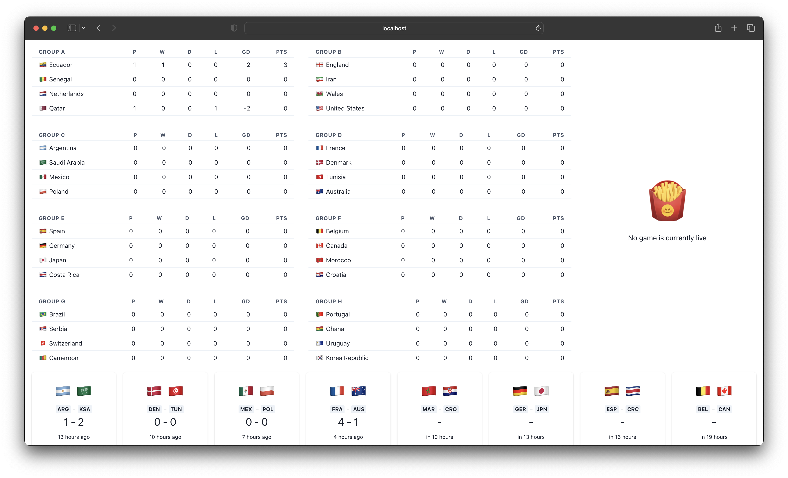

# liveCup

LiveCup is a live World Cup 2022 dashboard designed for TVs and Monitors, once the dashboard is open it will update information on a minute by minute basis about the following:

1. Group stage standings
2. Today and tomorrow's games
3. Current game brief

## Thanks

LiveCup is a small dashboard that only displays information all the data is gathered through [estien's world cup api](https://github.com/estiens/world_cup_json).
